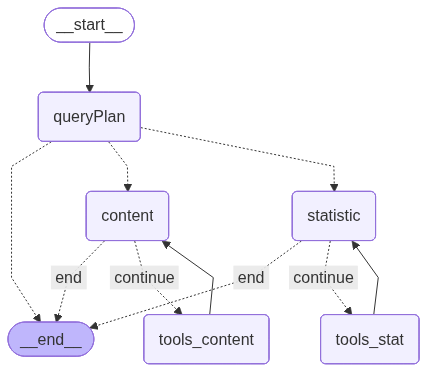

# Report

## 1. Architecture

- **Plan Agent**: Responsible for routing user questions to the appropriate agent based on the query type.  
- **Content Agent**: Provides answers derived from the content of the book.  
- **Statistic Agent**: Handles queries related to user log statistics, such as usage frequency and monthly activity reports.  

## 2. Achivements:

**A. Pipeline**  
- Pipeline đầy đủ (ingest / chunk / embed / index / retrieve): (oke)  
- Câu trả lời đúng các câu hỏi mẫu: (oke)  
- Có thể xử lý được các câu hỏi out-of-scope: 5  

**B. Multi-Agent**  
- Dựng graph LangGraph / LangChain đúng logic (state, nodes, edges): (oke)  
- Phân vai các agents rõ ràng: (oke)  
- Có Memory / Guardrails nhẹ (ví dụ: từ chối ngoài phạm vi): (oke)  

**C. ML/DL Core**  
- Lựa chọn embedding / reranking hợp lý: (oke)  
- Xử lý chunking / tokenization / độ dài context: (oke)  
- Có Test tối thiểu: 5  

**D. MLOps / Infra**  
- Có Dockerfile chạy end-to-end, logging rõ: (partly oke)  
- Cấu trúc repo sạch: (oke)  
- Hướng dẫn chạy: (oke)  
- Có README.md: (oke)  
- Code chạy được: (oke)  

## 3. Running code
- Generate your `API_KEY` from Google Gemini and add it to a `.env` file  
- Create Conda Environment (Python 3.10): conda create -n cypherAI python=3.10  
- Activate Environment & Install Dependencies: conda activate cypherAI && pip install -r requirements.txt  
- Run docker-compose up -d  
- Ingest Book into DB: python ingestPDF.py  
- Run python main.py and start chatting  

